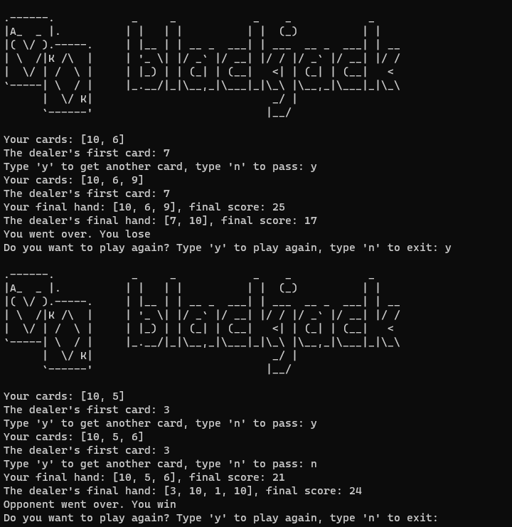

# Basic blackjack game using python
### This is a basic blackjack game in the CLI where you play against the computer



## Installation
```powershell
git clone https://github.com/ShayCohenn/blackjack_CLI_python.git
```
```powershell
cd blackjack_CLI_python
```
```powershell
py main.py
```